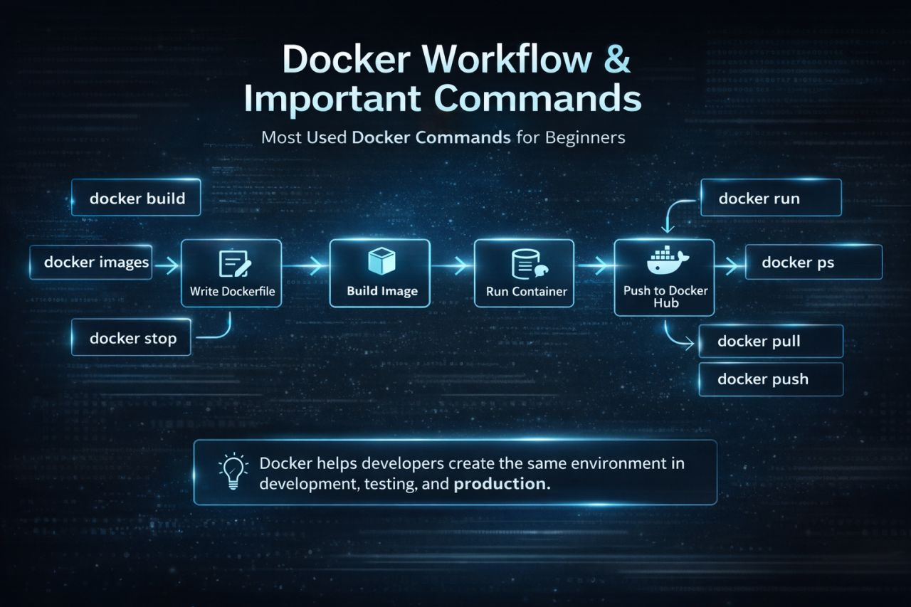

## 🔹 Docker

- Docker is a containerization platform for developing, packaging, shipping and running applications.
- It is an open-source platform that allows developers to build, package, and run applications inside containers.
  
---

## 🔹 Container

- Docker provides the ability to run an application in an isolated environment called container.
- It is an package of application with all the necessary dependencies and applications.
- It is a lightweight, standalone package that includes everything needed to run an application.
- Containers include: **Application code, Dependencies, Libraries, Runtime**
- This ensures the application runs the same in every environment.

---

## 🔹 Main Components of Dokcer

## Docker File

- It is a simple text file with an instructions to build an image.

## Docker Image

- It is a blueprint of a container.
- Single file with all the dependencies and libraries to run the program.
- Containers are created from images.

---

## Docker Architecture


Docker uses a client-server architecture.

### Components:

### **Docker Client**  
  - Where you run commands (e.g., `docker run`)

### **Docker Daemon**  
  - Runs in the background
  - manages containers and images  

### **Docker Registry**  
  - Stores Docker images  
  - Example: Docker Hub  
---

## 🔹 Docker Workflow

  

- Dockerfile contains instructions to build an image.
- Docker Image is a packaged application with all dependencies.
- Docker Container is the running instance of that image.
  
👉 Flow:

Dockerfile → Image → Container



This diagram shows how Docker works step by step with commonly used commands:

### 1. Write Dockerfile
- Define how your app should run  

### 2. Build Image
```bash
docker build
```
- Create an image from the Dockerfile

### 3. Run Container
```bash
docker run
```
- Start your application

### 4. Check Containers
```bash
docker ps
```
- View running containers

### 5. Stop Container
```bash
docker stop
```
- Stop a running container

### 6. Manage Images
```bash
docker images
```
- List available images

### 7. Push / Pull Images
```bash
docker push
docker pull
```
- Share images via Docker Hub

## Workflow Summary
Dockerfile → docker build → Image → docker run → Container

---

## 🔹 Real-World Example

**Without Docker:**

- App works on developer machine  
- Fails on server

**With Docker:**

- Same container runs everywhere ✅   
