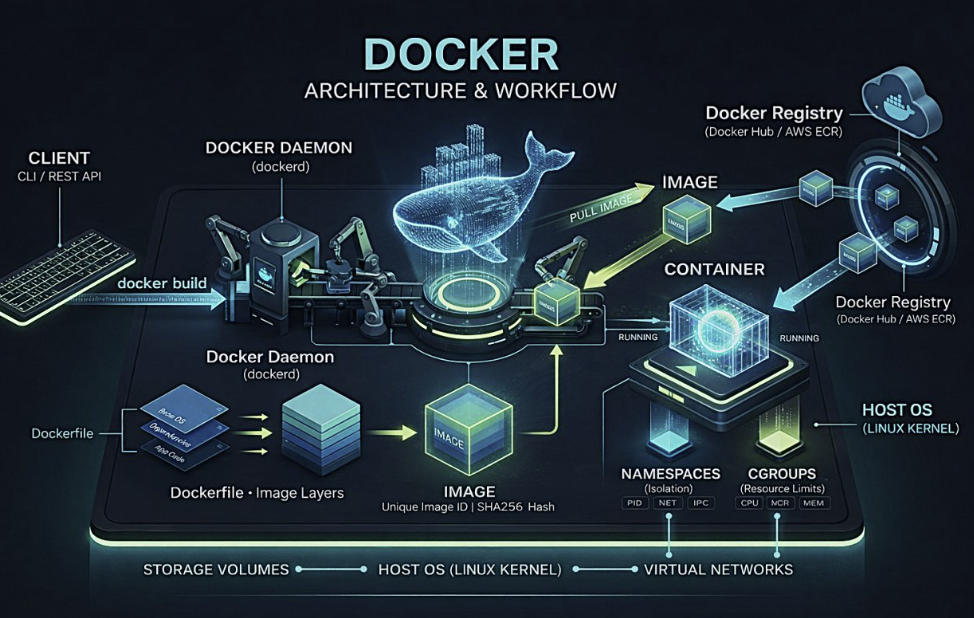
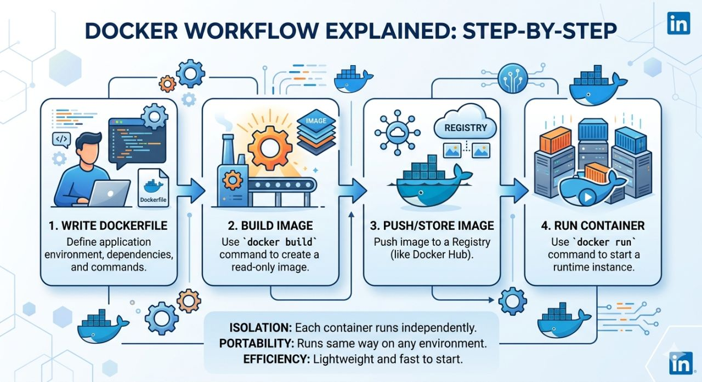

## 🔹 Docker

- It is a container platform to develop, build, ship, and run applications.
- It is open-source and lets developers run apps inside containers.
  
---

## 🔹 Container

- Docker lets you run apps in an isolated environment called a container.
- A container is a lightweight package with everything needed to run an app.
- It includes: code, dependencies, libraries, and runtime.
  
---

## 🔹 Main Components of Dokcer

### Docker File

- A file with instructions.
- It tells Docker how to create an image.

### Docker Image

- It is a blueprint of a container.
- Single file with all the dependencies and libraries to run the program.
- Containers are created from images.

### Docker Registry

- A place to store Docker images.
- You can upload and download images from here.

### Docker Hub

- A popular online registry.
- Developers use it to share and download images.
  
---

**Dockerfile → builds → Image → runs as → Container → stored in → Registry**

---

- Dockerfile → makes → Image
- Image → runs as → Container
- Images → stored in → Registry (like Docker Hub)

---

## 🔹 Docker Architecture

Docker uses a client-server architecture.

How Docker Works

#### Client
- You type commands like docker build or docker run.
  
#### Docker Daemon
- The engine that does all the work.
- It builds images and runs containers.
  
#### Dockerfile → Image
- Dockerfile has instructions.
- Docker uses it to create an image.
  
#### Image → Container
- Image is turned into a container (running app).
  
#### Docker Registry
- A place to store images (like Docker Hub).
- You can pull (download) or push (upload) images.

---

## 🔹 Docker Workflow

  

- First, write a Dockerfile.
- Then, build an image using docker build.
- Next, push the image to a registry like Docker Hub.
- Finally, run the image as a container using docker run.
  
👉 Flow:

Write → Build → Push → Run
