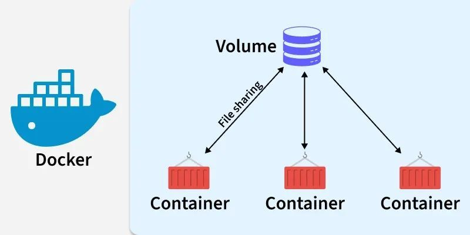

## Docker Volumes



- Volumes are a way to persist data generated by Docker containers.
- By default, container data is ephemeral (lost when the container is removed).
- Volumes solve this by storing data outside the container filesystem.

---

##  Types of Storage in Docker

- **Volumes (Recommended)**
- **Bind Mounts**
- **tmpfs** (temporary, in-memory storage)

---

## Create a Volume

```bash
docker volume create my_volume
```

## List volumes
```bash
docker volume ls
```

## Inspect volume
```bash
docker volume inspect my_volume
```

## Use Volume in Container
```bash
docker run -d \
  -v my_volume:/app/data \
  --name my_container \
  nginx
```
👉 This mounts: my_volume → inside container at /app/data

---

## Anonymous vs Named Volumes

### Named Volume
```bash
-v my_volume:/data
```
Easy to reuse
Managed by Docker

### Anonymous Volume
```bash
-v /data
```
Docker auto-generates name
Harder to manage

---

## Bind Mounts (Host → Container)
```bash
docker run -d \
  -v /host/path:/container/path \
  nginx
```
👉 Directly maps your local directory.

---

## Read-Only Volume
```bash
docker run -d \
  -v my_volume:/data:ro \
  nginx
```
👉 :ro = read-only

---

## Remove Volume
```bash
docker volume rm my_volume
```

## Remove unused volumes
```bash
docker volume prune
```
---

## Volume with Docker Compose
```bash
version: "3"

services:
  app:
    image: nginx
    volumes:
      - my_volume:/usr/share/nginx/html

volumes:
  my_volume:
```
