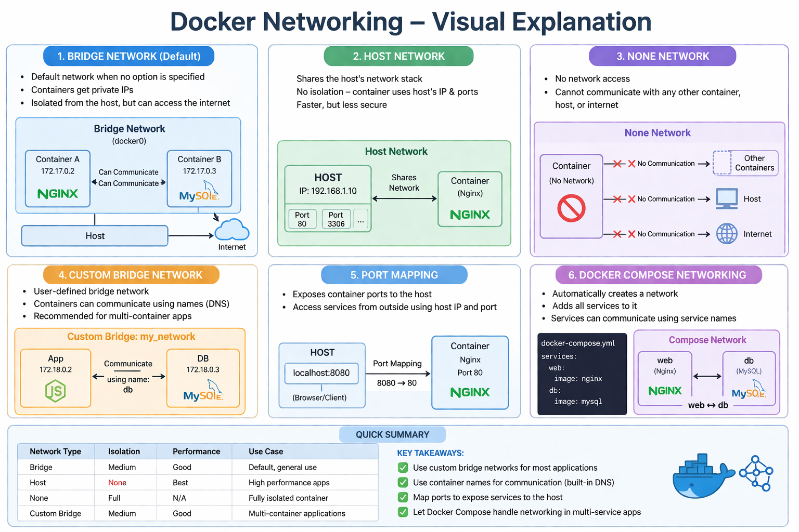
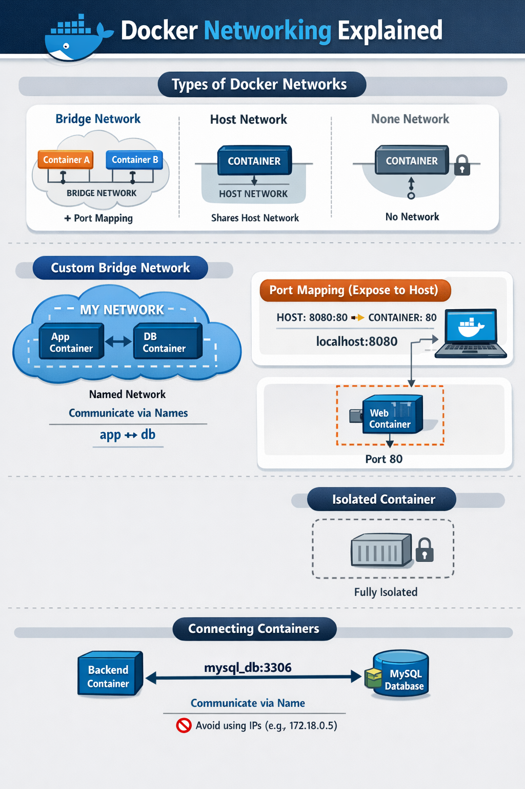

## Docker Networking

- Docker networking allows containers to communicate: With each other, With the host, With external systems  
- Each container runs in an isolated environment, and networking connects them.
- Containers are isolated by default.

---



## 🔹 Default Network Types in Docker

### 1️⃣ Bridge Network (Default)

- Used when you run containers without specifying a network  
- Containers get private IPs  
- Can communicate using IP (or name in custom bridge)  

```bash
docker network ls
```
Run container on bridge:
```bash
docker run -d nginx
```

---

### 2️⃣ Host Network
- Container shares host’s network
- No isolation
- Faster performance
```bash
docker run -d --network host nginx
```

---

### 3️⃣ None Network
- No networking at all
```bash
docker run -d --network none nginx
```
👉 Fully isolated container

---

## Custom Bridge Network (Recommended)
```bash
docker network create my_network
```
Run containers in same network:
```bash
docker run -d --name app --network my_network nginx
docker run -d --name db --network my_network mysql
```
👉 Now containers can talk using names:
app → db

---

## Container Communication

### 🔸Using Container Name (DNS)

Docker provides internal DNS:
```bash
ping db
```
👉 Works inside same custom network

### 🔸Using IP Address (Not Recommended)
```bash
docker inspect <container>
```
👉 IP can change → avoid using it

---

## Port Mapping (Expose to Host)
```bash
docker run -d -p 8080:80 nginx
```
Mapping:
- Host: localhost:8080
- Container: 80

---

## Inspect Network
```bash
docker network inspect my_network
```
Shows:
- Connected containers
- IP addresses
- Subnet

---

## Connect / Disconnect Containers
```bash
docker network connect my_network my_container
docker network disconnect my_network my_container
```
---

## Docker Compose Networking
```bash
version: "3"

services:
  web:
    image: nginx
  db:
    image: mysql
```
👉 Docker Compose automatically:
- Creates a network
- Adds both services to it
- Enables communication using service names (web, db)

## Revision

