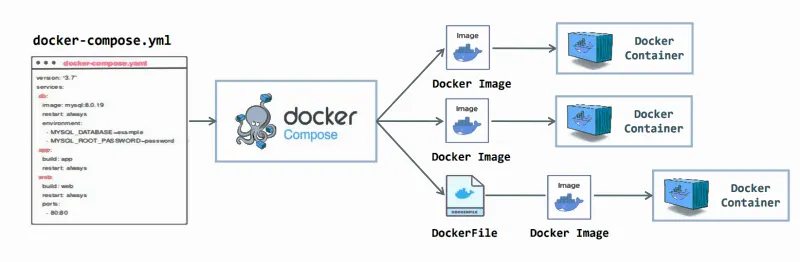

## Docker Compose



It is a tool used to **define and run multi-container Docker applications** using a simple YAML file.

👉 Instead of running multiple `docker run` commands, you define everything in one file.

---

## 🔹 Basic Structure (`docker-compose.yml`)

```yaml
version: "3"

services:
  web:
    image: nginx
    ports:
      - "8080:80"

  db:
    image: mysql
    environment:
      MYSQL_ROOT_PASSWORD: example
```

## Key Components

### 1️⃣ services
Defines containers (e.g., web, db)

### 2️⃣ image / build
- image: Use prebuilt image
- build: Build from Dockerfile

### 3️⃣ ports
```bash
ports:
  - "8080:80"
```

### 4️⃣ volumes
```bash
volumes:
  - my_volume:/data
```

### 5️⃣ environment
```bash
nvironment:
  - MYSQL_ROOT_PASSWORD=pass
```
---

## Run Docker Compose

### Start services
docker-compose up

### Detached mode
docker-compose up -d

### Stop services
docker-compose down

---

## Volumes in Compose
```basah
services:
  db:
    image: mysql
    volumes:
      - db_data:/var/lib/mysql

volumes:
  db_data:
```
👉 Data persists even after container removal

---

## Networking in Compose
- Automatically creates a default network
- Services communicate using service names

## Build from Dockerfile
```bash
services:
  app:
    build: .
    ports:
      - "5000:5000"
```
---

## Commands
- docker-compose ps        # List containers
- docker-compose logs      # View logs
- docker-compose build     # Build images
- docker-compose restart   # Restart services
